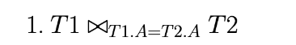
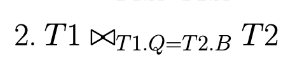
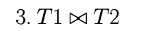
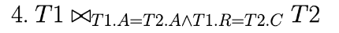
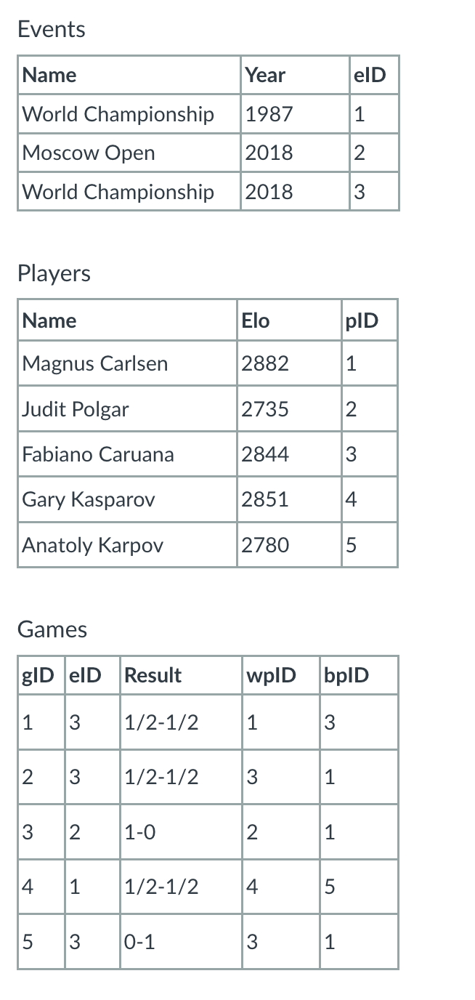
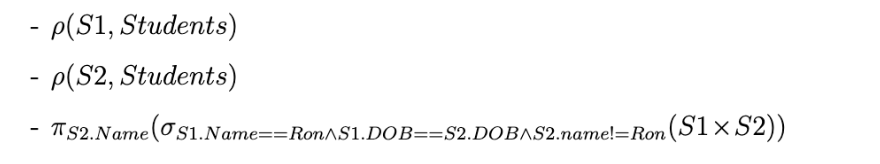

 # Relational Algebra
    Yuyao TU

# Part 1 - Joins
### T1
```
| A  | Q  | R  |
|----|----|----|
| 20 | a  | 5  |
| 25 | b  | 8  |
| 35 | a  | 6  |
```
### T2
```
| A  | B  | C  |
|----|----|----|
| 20 | b  | 6  |
| 45 | c  | 3  |
| 20 | b  | 5  |
```

## Query Results

### Query 1: 

Result table:
```
| A  | Q  | R  | B  | C  |
|----|----|----|----|----|
| 20 | a  | 5  | b  | 6  |
| 20 | a  | 5  | b  | 5  |
```
### Query 2: 

Result table:
```
| A  | Q  | R  | A  | B  | C  |
|----|----|----|----|----|----|
| 25 | b  | 8  | 20 | b  | 6  |
| 25 | b  | 8  | 20 | b  | 5  |
```
### Query 3: 

Result table: 
```
| A  | Q  | R  | B  | C  |
|----|----|----|----|----|
| 20 | a  | 5  | b  | 6  |
| 20 | a  | 5  | b  | 5  |
```
### Query 4: 
Result table:
```
| A  | Q  | R  | B  | C  |
|----|----|----|----|----|
| 20 | a  | 5  | b  | 5  |
```
# Part 2 - Chess Queries

1. Find the names of any player with an Elo rating of 2850 or higher.
```sql
π_Name(σ_Elo ≥ 2850 (Players))
```
2. Find the names of any player who has ever played a game as white.
```sql
π_Name(ρ(wpID→pID, Games) ⋈ Players)
```
3. Find the names of any player who has ever won a game as white.
```sql
π_Name(ρ(wpID→pID, σ_Result = '1-0' (Games)) ⋈ Players)
```
4. Find the names of any player who played any games in 2018.
```sql
ρ_game2018(Events ⋈ Events.eID = Game.eID ∧ Events.years = '2018' Game)
```

```sql
π_Name(game2018 ⋈ Game2018.wpID = Players.pID ∨ Game2018.bpID = Players.pID Players)
```
5. Find the names and dates of any event in which Magnus Carlsen lost a game.
```sql
π_Name, Date(σ_Result = '0-1' (Games ⋈ (σ_Name = 'Magnus Carlsen' (Players ⋈ Events))))
```
6. Find the names of all opponents of Magnus Carlsen. An opponent is someone who he has played a game against. Hint: Both Magnus and his opponents could play as white or black.
```sql
π_Name((σ_Name = 'Magnus Carlsen' (Players ⋈ Games)) ⋈_{pID ≠ wpID} (Players ⋈_{pID = bpID} Games))
```
# Part 3 - LMS Queries

### Part 3.1:


a) Provide the relation that is the result of the following query. Your relation should be in the form of a table, and should include the schema.
1. This step involves selecting (\sigma) the records from the Enrolled table where the grade (Grd) is 'C'.
2. Projecting (\pi) the student ID (sID) from the filtered records.
3. Renaming the result to C.
```sql
|  C  |
|-----|
| 3   | 
| 4   | 
```
1. Projecting (\pi) the student ID (sID) from the Enrolled table.
2. Subtracting (-) the result of step 1 (students who received a 'C') from this projection.
3. Performing a natural join (\bowtie) with the Students table to get the names of students who did not receive a 'C' in any course.
```sql
2.
|    Name  |
|----------|
| Hermione | 
| Harry    | 
```
b) Provide a simple English description of what the query is searching for. Your description should be in general terms (remember that the original LMS instance data may change).

The query finds the names of students who have never received a grade of 'C' in any of their courses.
### Part 3.2:

a) Provide the relation that is the result of the following query. Your relation should be in the form of a table, and should include the schema.
1. Rename the Students table to S1:
```sql
            S1:
| sID | Name     | DOB  |
|-----|----------|------|
| 1   | Hermione | 1980 |
| 2   | Harry    | 1979 |
| 3   | Ron      | 1980 |
| 4   | Malfoy   | 1982 |
```
2. Rename the Students table to S2:
```sql
            S2:
| sID | Name     | DOB  |
|-----|----------|------|
| 1   | Hermione | 1980 |
| 2   | Harry    | 1979 |
| 3   | Ron      | 1980 |
| 4   | Malfoy   | 1982 |
```
3. Perform Cartesian product and select the tuples that satisfy the conditions:

The resulting relation would be:
```
|    Name  |
|----------|
| Hermione | 
```

b) Provide a simple English description of what the query is searching for. Your description should be in general terms (remember that the original LMS instance data may change).

The query searches for the names of students who were born in the same year as a student named Ron but have a different name.

# Part 3.3:

a) Provide the relation that is the result of the following query. Your relation should be in the form of a table, and should include the schema.
1. Project the cID and sID columns from the Enrolled table:
```sql
SELECT cID, sID FROM Enrolled;

| cID  | sID |
|------|-----|
| 3500 | 1   |
| 3810 | 1   |
| 5530 | 1   |
| 3810 | 2   |
| 5530 | 2   |
| 3500 | 3   |
| 3810 | 3   |
| 3500 | 4   |
```
2. Project the sID column from the Students table:
```sql
SELECT sID FROM Students;

| sID |
|-----|
| 1   |
| 2   |
| 3   |
| 4   |
```
3. Divide the projected Enrolled relation by the projected Students relation:
```sql
| cID  |
|------|
| 3500 |
| 3810 |
| 5530 |
```
4. Join the result with the Courses table and project the cName column:
```sql
| cName         |
|---------------|
| SW Practice   |
| Architecture  |
| Databases     |
```
b) Provide a simple English description of what the query is searching for. Your description should be in general terms (remember that the original LMS instance data may change).

The query searches for the names of courses in which all students are enrolled.

# Part 4
Provide a relational algebra query that uses the divide operator to find the names of all students who are taking all of the 3xxx-level classes.
```sql
π_name[(π_sID,cID(Enrolled)/ π_cID(σ_cID >= 3000 ∧ cID < 4000(Courses)))⋈ Students]
```
